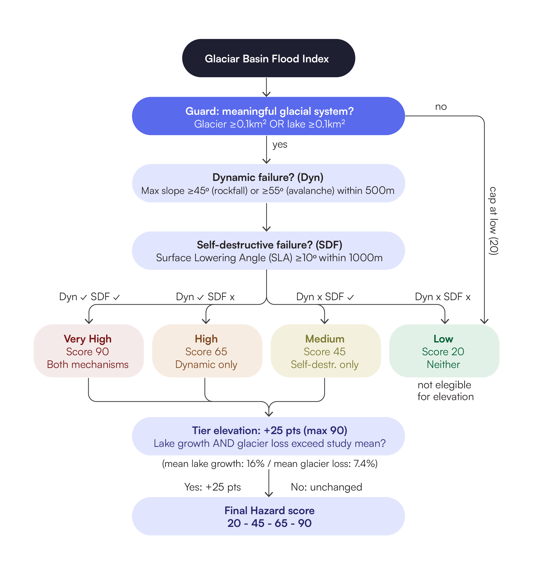
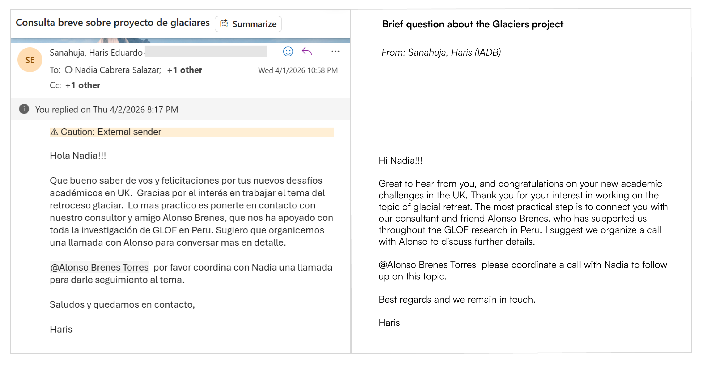
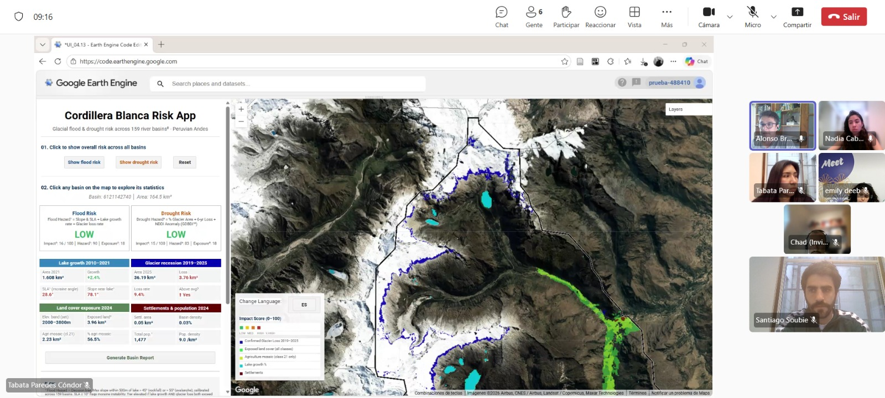

# Cordillera Blanca Risk App (CBRA) {.unnumbered}

## Project Summary 

Following stakeholder interviews with the Inter-American Development Bank (IADB) - advisor to Peru's disaster risk authorities - SQLitos' Cordillera Blanca Risk App (CBRA) is a preliminary geospatial analysis tool supporting CENEPRED (National Center for Disaster Risk Estimation, Prevention and Reduction) in Peru's national disaster risk system (SINAGERD).
CBRA enables generalist government staff to identify communities at risk from glacial melt in the Cordillera Blanca (Peruvian Andes). It uses multi-temporal analysis in Google Earth Engine and maps Glacial Lake Outburst Flood (GLOF) risk across 159 river basins from 2010 to 2025, highlighting high-impact zones for mitigation prioritisation.


## Problem Statement 

Peru holds about 70% of the world's tropical glaciers (Chevallier et al., 2011) and the Cordillera Blanca’s Santa Basin is the #2 most dangerous globally for GLOFs, threatening 0.9 million people (Taylor et al.,2023). Glaciers are retreating 1.24% annually and glacial lakes grew 16% (2010-2021) - intensifying flood risk. Yet GLOFs are underreported (Zhang et al, 2025), Andes-focused research is scarce (Emmer, A, 2018, 2022)  and existing tools like IADB Risk Hub require training. Generalist staff at CENEPRED, who coordinate SINAGERD’s disaster response lack an accessible preliminary analysis tool to rapidly identify newly vulnerable communities and prioritise mitigation.


## End User 

This app is designed to support decision-making for regional and municipal governments, water management authorities, and NGOs in Peru’s Ancash region, with a focus on those responsible for daily decisions related to disaster preparedness, agricultural planning, and resource allocation for downstream communities. It provides accessible risk maps tailored to decision-makers without a remote sensing background, enabling them to quickly identify vulnerable communities and allocate resources effectively. Ultimately, the tool can be expanded to service other glacier-depndent neighbouring governments in the Andes, such as Bolivia, and beyond.

## Data

All data are publicly available and processed entirely within Google Earth Engine (GEE).

<table>
<caption>Datasets used in the analysis</caption>
<thead>
<tr>
  <th>Dataset</th>
  <th>Source</th>
  <th>Period</th>
  <th>Link</th>
</tr>
</thead>
<tbody>
<tr>
  <td>JRC Global Surface Water v1.4</td>
  <td>Pekel et al. 2016</td>
  <td>2010–2021</td>
  <td><a href="https://doi.org/10.1038/nature20584">doi.org/10.1038/nature20584</a></td>
</tr>
<tr>
  <td>Sentinel-2 SR Harmonised</td>
  <td>ESA / Google</td>
  <td>2019–2025</td>
  <td><a href="https://developers.google.com/earth-engine/datasets/catalog/COPERNICUS_S2_SR_HARMONIZED">GEE catalog</a></td>
</tr>
<tr>
  <td>SRTM DEM</td>
  <td>NASA / USGS</td>
  <td>2000</td>
  <td><a href="https://developers.google.com/earth-engine/datasets/catalog/USGS_SRTMGL1_003">GEE catalog</a></td>
</tr>
<tr>
  <td>HydroSHEDS Level-12 Basins</td>
  <td>Lehner et al.</td>
  <td>2008</td>
  <td><a href="https://developers.google.com/earth-engine/datasets/catalog/WWF_HydroSHEDS_v1_Basins_hybas_12">GEE catalog</a></td>
</tr>
<tr>
  <td>MapBiomas Peru Collection 3</td>
  <td>MapBiomas 2024</td>
  <td>2024</td>
  <td><a href="https://peru.mapbiomas.org/">peru.mapbiomas.org</a></td>
</tr>
<tr>
  <td>Dynamic World v1</td>
  <td>Google / ESA</td>
  <td>2024</td>
  <td><a href="https://developers.google.com/earth-engine/datasets/catalog/GOOGLE_DYNAMICWORLD_V1">GEE catalog</a></td>
</tr>
<tr>
  <td>WorldPop 100m</td>
  <td>WorldPop 2020</td>
  <td>2020</td>
  <td><a href="https://developers.google.com/earth-engine/datasets/catalog/WorldPop_GP_100m_pop">GEE catalog</a></td>
</tr>
<tr>
  <td>RGI v7.0</td>
  <td>RGI Consortium</td>
  <td>2023</td>
  <td><a href="https://gee-community-catalog.org/projects/rgi/">gee-community-catalog.org</a></td>
</tr>
<tr>
  <td>Watershed boundaries / National river network</td>
  <td>National Water Authority of Peru (ANA)</td>
  <td>2026</td>
  <td>Definition of study area</td>
</tr>
</tbody>
</table>

## Methodology

#### Area of study 
The study covers micro-watersheds in the Cordillera Blanca, Ancash (2025), delineated using official ANA boundaries and filtered by direct hydrological influence on the range.

#### Glacier Retreat Model 
Glacier extent mapped via Sentinel-2 MSI (2019–2025), dry season only, validated against RGI v7 (−2.1%). Total loss: 7.4% (496 → 459 km²).


::: {.scroll-container style="overflow-y: scroll; height: 400px; padding: 20px; border: 1px solid #ddd; border-radius: 6px;"}
```javascript
// ════════════════════════════════════════════════════════════════
// Glacier Recession (2019–2025)
//
// Goal: detect how much glacier ice has been lost between 2019
// and 2025 using Sentinel-2 satellite imagery.
// We use the NDSI (Normalised Difference Snow Index) to identify
// snow and ice pixels, then compare the two years to find
// where glacier has disappeared.
// ════════════════════════════════════════════════════════════════

// ── Step 1: Cloud masking function ───────────────────────────────
// Sentinel-2 images often contain clouds which look bright and
// could be mistaken for snow or ice. Before doing any analysis
// we must remove cloud pixels.
// Sentinel-2 includes a Scene Classification Layer (SCL band)
// which labels every pixel by what it is. We keep only the
// pixel types that are safe to use:
//   4  = vegetation (safe)
//   5  = bare soil / rock (safe)
//   6  = water (safe)
//   7  = unclassified (safe to include)
//   11 = snow and ice ← the most important one for us
// Everything else (clouds, cloud shadows, saturated pixels)
// is masked out and treated as missing data
function maskS2clouds(image) {
  var scl = image.select('SCL'); // Select the classification band
  return image.updateMask(
    scl.eq(4).or(scl.eq(5)).or(scl.eq(6))
      .or(scl.eq(7)).or(scl.eq(11))
    // updateMask hides any pixel NOT in this list
  );
}

// ── Step 2: Load and filter the Sentinel-2 image collection ──────
// Sentinel-2 is a European Space Agency satellite that images
// the Earth every 5 days at 10–20m resolution.
// We use the Surface Reflectance version (SR_HARMONIZED) which
// has already been corrected for atmospheric effects like haze.
// We apply three filters before doing any analysis:
var sentinel2 = ee.ImageCollection('COPERNICUS/S2_SR_HARMONIZED')
  .filterBounds(STUDY_AREA)                        // Only images that
                                                  // cover our study area
  .filter(ee.Filter.calendarRange(6, 9, 'month')) // Only June–September
                                                  // (dry season = less cloud,
                                                  // no seasonal snow confusion)
  .filter(ee.Filter.lt('CLOUDY_PIXEL_PERCENTAGE', 20)) // Reject any image
                                                        // that is more than
                                                        // 20% cloud covered
  .map(maskS2clouds);                             // Apply the pixel-level
                                                  // cloud mask to every image

// ── Step 3: Function to detect glacier extent for any year ────────
// For a given year this function:
// 1. Filters the collection to just that year
// 2. Takes the median of all images (best cloud-free composite)
// 3. Computes NDSI to identify snow and ice
// 4. Applies a water filter to avoid confusing lakes with glaciers
// 5. Returns a binary image: 1 = glacier, 0 = not glacier
function getGlacierMask(year) {

  // Combine all dry-season images from this year into one
  // clean composite by taking the median value of each pixel.
  // Median is used rather than mean because it is more robust
  // to outliers — a single cloudy image won't skew the result.
  var composite = sentinel2
    .filter(ee.Filter.calendarRange(year, year, 'year'))
    .median()       // One clean image from multiple observations
    .clip(STUDY_AREA);

  // ── NDSI calculation ────────────────────────────────────────
  // NDSI = (Green - SWIR) / (Green + SWIR)
  // Snow and ice reflect green light strongly but absorb
  // shortwave infrared (SWIR). This makes their NDSI value
  // strongly positive (close to +1).
  // Vegetation, rock, and soil have low or negative NDSI.
  // For Sentinel-2: Green = Band 3, SWIR = Band 11
  // normalizedDifference handles the formula automatically
  // and avoids division by zero errors.
  // Threshold 0.35: pixels with NDSI ≥ 0.35 are classified
  // as glacier/snow. This is the standard glaciology threshold.
  return composite.normalizedDifference(['B3', 'B11'])
    .gte(0.35)                        // Apply the 0.35 threshold

    // ── Water filter ───────────────────────────────────────
    // Problem: lakes and rivers also have high NDSI because
    // water also absorbs SWIR. Without this filter we would
    // incorrectly classify lakes as glaciers.
    // Solution: ice reflects NIR (Band 8) strongly, but water
    // absorbs NIR almost completely. So we require NIR > 1000
    // (in raw Sentinel-2 units, where 10000 = 100% reflectance,
    // so 1000 = 10% reflectance minimum).
    // This removes water bodies while keeping snow and ice.
    .and(composite.select('B8').gt(1000))

    .rename('glacier')  // Name the output band 'glacier'
    .toFloat();         // Convert to floating point for export
}

// ── Step 4: Create glacier maps for 2019 and 2025 ────────────────
var glacierMask2019 = getGlacierMask(2019); // Glacier extent in 2019
var glacierMask2025 = getGlacierMask(2025); // Glacier extent in 2025

// ── Step 5: Calculate glacier loss ───────────────────────────────
// Subtract 2025 from 2019:
//   2019 pixel = 1, 2025 pixel = 1 → result = 0  (still glacier)
//   2019 pixel = 1, 2025 pixel = 0 → result = 1  (glacier LOST)
//   2019 pixel = 0, 2025 pixel = 0 → result = 0  (never glacier)
//   2019 pixel = 0, 2025 pixel = 1 → result = -1 (new glacier?)
// .gt(0) keeps only the positive values — pixels that were glacier
// in 2019 but are no longer glacier in 2025. These are the areas
// of confirmed glacier recession over the 6-year period.
var glacierLoss = glacierMask2019.subtract(glacierMask2025)
  .gt(0)
  .rename('glacier_loss')
  .toFloat();

// ── Add layers to map for visual inspection ───────────────────────
// All hidden by default — turn on in the Layers panel to verify
// the glacier detection looks correct before exporting

Map.addLayer(glacierMask2019.selfMask(),
  {palette:['ffffff'], opacity:0.5}, // White = glacier in 2019
  'Glacier 2019 (white)', false);

Map.addLayer(glacierMask2025.selfMask(),
  {palette:['00e5ff'], opacity:0.8}, // Cyan = glacier in 2025
  'Glacier 2025 (cyan)', false);

Map.addLayer(glacierLoss.selfMask(),
  {palette:['FF4444'], opacity:0.8}, // Red = lost between 2019–2025
  'Glacier loss (red)', false);
```
:::

#### Glacial Lake Detection and Growth 
JRC Global Surface Water (2010–2021), restricted to 3,800–6,800 m. Lake area grew 16% (50.65 → 58.75 km²). The following variables were derived from detected lakes to feed directly into the flood hazard scoring framework.

<table>
<caption>Dry-season maximum (Jun–Sep) used to minimize cloud cover and snow interference. Elevation band 3,800–6,800 m excludes valley-floor water bodies unrelated to glacial dynamics. Pekel et al. (2016), Fujita et al. (2013)</caption>
<thead>
<tr>
  <th>Variable</th>
  <th>Measurement</th>
  <th>Purpose</th>
  <th>Source</th>
</tr>
</thead>
<tbody>
<tr>
  <td>Growth rate</td>
  <td>% change in lake area (km²)</td>
  <td>Tier elevation trigger</td>
  <td>JRC Global Surface Water (2010–2021)</td>
</tr>
<tr>
  <td>Avalanche risk</td>
  <td>Mean slope within 500 m</td>
  <td>Feeds dynamic failure score</td>
  <td>SRTM DEM, NASA/USGS (2000)</td>
</tr>
<tr>
  <td>Moraine stability</td>
  <td>SLA within 1,000 m</td>
  <td>Feeds self-destructive failure score</td>
  <td>SRTM DEM, NASA/USGS (2000)</td>
</tr>
</tbody>
</table>

::: {.scroll-container style="overflow-y: scroll; height: 400px; padding: 20px; border: 1px solid #ddd; border-radius: 6px;"}
```javascript
// ════════════════════════════════════════════════════════════════
// Lake Basin Change Detection (2010–2021)
// 
// Goal: detect how much glacial lakes have grown over 11 years
// using satellite water detection data from the JRC dataset.
// We compare lake area in 2010 vs 2021 and calculate how much
// each lake has grown, how steep the surrounding terrain is,
// and how stable the moraine dam in front of each lake is.
// ════════════════════════════════════════════════════════════════

// ── Time range we are analysing ──────────────────────────────────
var START_YEAR  = 2010;  // First year of analysis
var END_YEAR    = 2021;  // Last year of analysis
var MIN_AREA_M2 = 5000;  // Ignore any water body smaller than 5000m²
                          // (removes noise pixels that aren't real lakes)

// ── Load the JRC water dataset ────────────────────────────────────
// JRC Global Surface Water (Pekel et al. 2016) records every month
// whether each 30m pixel on Earth was water, land, or unobserved.
// It goes back to 1984 using Landsat satellite imagery.
var jrcMonthly = ee.ImageCollection('JRC/GSW1_4/MonthlyHistory');

// ── Function: create a lake map for any given year ────────────────
// This function takes a year number and returns a binary image:
// 1 = water pixel, 0 = not water
// We only look at June–September (dry season) because:
// - Cloud cover is lowest in the dry season
// - Snow melt is minimal so water pixels are clearly lakes not snow
// - Lake area is most stable so we get a consistent measurement
function getJRCWaterMask(year) {
  var start = ee.Date.fromYMD(year, 6, 1);  // 1st June
  var end   = ee.Date.fromYMD(year, 9, 30); // 30th September

  return jrcMonthly
    .filterDate(start, end)        // Keep only June–September images
    .map(function(img) {
      return img.eq(2);            // Value 2 = permanent water in JRC
                                   // (value 1 = seasonal, 0 = land)
    })
    .max()                         // Take the maximum across all months
                                   // so if water appears in ANY month
                                   // that pixel counts as water
    .clip(STUDY_AREA)               // Cut to our study rectangle
    .eq(1)                         // Convert to binary: 1=water, 0=other
    .and(elevMask)                 // Apply elevation filter: only keep
                                   // pixels between 3800m and 6800m
                                   // (glacial lake elevation range)
    .rename('water');              // Name the band 'water' for clarity
}

// ── Create lake maps for 2010 and 2021 ───────────────────────────
var lakeMask2010 = getJRCWaterMask(2010);
var lakeMask2021 = getJRCWaterMask(2021);

// ── Print total lake area to the console ─────────────────────────
// This is a quick sanity check — we count all water pixels and
// multiply by pixel area (30m × 30m = 900m² = 0.0009 km²)
print('2010 lake area km²:', ee.Number(
  lakeMask2010.reduceRegion({
    reducer:   ee.Reducer.sum(),  // Add up all the 1s (water pixels)
    geometry:  STUDY_AREA,
    scale:     30,                // 30m pixel size matches JRC resolution
    maxPixels: 1e10,              // Allow large computations
    bestEffort:true               // If too large, scale up automatically
  }).get('water', 0)             // Get the sum, default 0 if missing
).multiply(0.0009));             // Convert pixel count → km²

print('2021 lake area km²:', ee.Number(
  lakeMask2021.reduceRegion({
    reducer:   ee.Reducer.sum(),
    geometry:  STUDY_AREA,
    scale:     30,
    maxPixels: 1e10,
    bestEffort:true
  }).get('water', 0)
).multiply(0.0009));

// ── Function: convert water pixels into lake polygons ─────────────
// Instead of working with individual pixels, we group connected
// water pixels together into polygon shapes — one polygon per lake.
// This lets us calculate the area, location, and shape of each lake.
function getJRCLakes(year) {
  return getJRCWaterMask(year)
    .selfMask()                    // Hide the 0 (non-water) pixels
                                   // so only water pixels are processed
    .reduceToVectors({
      geometry:     STUDY_AREA,
      scale:        30,
      geometryType: 'polygon',     // Output as polygon shapes
      eightConnected: false,       // Only connect pixels sharing an edge
                                   // (not diagonal) — reduces noise
      labelProperty: 'water',
      bestEffort:   true,
      maxPixels:    1e10
    })
    .map(function(f) {
      // For each lake polygon, calculate and store its area
      var area = f.geometry().area(1); // Area in m² (1m tolerance)
      return f.set({
        'area_m2':  area,
        'area_km2': ee.Number(area).divide(1e6), // Convert to km²
        'year':     year                          // Remember which year
      });
    })
    // Remove anything smaller than 5000m² — these are noise pixels
    // not real glacial lakes
    .filter(ee.Filter.gte('area_m2', MIN_AREA_M2));
}

// ── Get lake polygons for both years ─────────────────────────────
var earlyLakes = getJRCLakes(START_YEAR); // 2010 lakes
var lateLakes  = getJRCLakes(END_YEAR);   // 2021 lakes

// ── Match each 2021 lake to its 2010 version ──────────────────────
// We need to know which lake in 2021 corresponds to which lake in 2010
// so we can calculate how much each individual lake grew.
// The Join works by checking if a 2021 lake polygon overlaps spatially
// with a 2010 lake polygon — if they intersect, they are the same lake.
// saveFirst means: for each 2021 lake, save the best matching 2010 lake
// as a property called 'early_match'
var joined = ee.Join.saveFirst('early_match').apply({
  primary:   lateLakes,   // 2021 lakes (main table)
  secondary: earlyLakes,  // 2010 lakes (lookup table)
  condition: ee.Filter.intersects({
    leftField:  '.geo',   // Use the polygon geometry for matching
    rightField: '.geo',
    maxError:   10        // Allow 10m tolerance for alignment errors
  })
});
// Note: lakes that existed in 2021 but NOT in 2010 are dropped here
// because they have no match. Only lakes present in both years are kept.

// ── Calculate growth + slope + SLA + hazard score per lake ────────
// For every matched lake pair, we compute four things:
// 1. How much the lake grew (%)
// 2. Mean slope within 500m (avalanche trigger risk)
// 3. SLA — mean slope within 1000m (moraine stability)
// 4. A combined hazard score (0–1)
var lakeGrowthStats = joined.map(function(f) {

  var lakeGeom  = f.geometry(); // The 2021 lake polygon shape

  // Get the area of this lake in 2010 from the matched early feature
  var earlyArea = ee.Number(ee.Feature(f.get('early_match')).get('area_km2'));
  // Get the area of this lake in 2021
  var lateArea  = ee.Number(f.get('area_km2'));

  // Calculate percentage growth:
  // (2021 area - 2010 area) / 2010 area × 100
  var pctChange = lateArea.subtract(earlyArea)
    .divide(earlyArea).multiply(100);

  // ── Slope metric 1: mean slope within 500m of the lake ───────
  // A steep 500m buffer means mass movements (avalanches, rockfalls)
  // are more likely to enter the lake and trigger a GLOF
  // Threshold from Rounce et al. (2017): >25° = high risk
  var slope500m = ee.Number(slope.reduceRegion({
    reducer:    ee.Reducer.mean(),
    geometry:   lakeGeom.buffer(500), // Expand lake outward by 500m
    scale:      30,
    maxPixels:  1e10,
    bestEffort: true
  }).get('slope', 0)); // Default 0 if no result

  // ── Slope metric 2: SLA within 1000m (moraine stability) ─────
  // The Steep Lakefront Area measures how steeply the terrain drops
  // in front of the moraine dam.
  // Fujita et al. (2013): SLA > 10° = moraine potentially unstable
  var slaValue = ee.Number(slope.reduceRegion({
    reducer:    ee.Reducer.mean(),
    geometry:   lakeGeom.buffer(1000), // Wider 1000m buffer
    scale:      30,
    maxPixels:  1e10,
    bestEffort: true
  }).get('slope', 0));

  // ── Hazard score: combine lake size + slope + SLA ─────────────
  // Each component is normalised to 0–1 so they can be combined fairly
  // Weights follow Rounce et al. (2017):
  //   Lake size: 40% — bigger lakes release more water in a GLOF
  //   Slope:     35% — steeper terrain = higher avalanche risk
  //   SLA:       25% — unstable moraine = higher self-destruction risk

  var lakeScore  = lateArea.divide(2.0).min(1.0);
  // A lake ≥ 2 km² scores maximum (1.0), smaller lakes score less

  var slopeScore = slope500m.divide(30.0).min(1.0);
  // A slope ≥ 30° scores maximum (1.0)

  var slaScore   = slaValue.subtract(10).divide(20).max(0).min(1.0);
  // Below 10° scores 0 (stable), 30°+ scores 1.0 (very unstable)
  // The subtract(10) means the first 10° don't count at all

  var hazardScore = lakeScore.multiply(0.4)   // 40% weight
    .add(slopeScore.multiply(0.35))            // 35% weight
    .add(slaScore.multiply(0.25));             // 25% weight

  // ── Store all computed values on the feature ──────────────────
  return f.set({
    'area_2010_km2':  earlyArea,   // Lake area in 2010
    'area_2021_km2':  lateArea,    // Lake area in 2021
    'pct_change':     pctChange,   // Growth % over 11 years
    'slope_500m_deg': slope500m,   // Mean slope in 500m buffer (degrees)
    'sla_deg':        slaValue,    // SLA — mean slope in 1000m buffer
    'sla_unstable':   slaValue.gte(10), // true if SLA ≥ 10° (unstable)
    'hazard_score':   hazardScore, // Combined score 0–1
    'early_match':    null         // Clear the nested feature to avoid
                                   // export errors (see fix below)
  });
});

// ── FIX: Remove the nested early_match property ───────────────────
// The Join stored the 2010 lake as a nested Feature inside each row.
// GEE cannot export a Feature-inside-a-Feature to an asset table.
// So we create a clean copy that only keeps the computed properties.
var lakeGrowthStatsClean = lakeGrowthStats.map(function(f) {
  return ee.Feature(f.geometry(), {
    'area_2010_km2':  f.get('area_2010_km2'),
    'area_2021_km2':  f.get('area_2021_km2'),
    'pct_change':     f.get('pct_change'),
    'slope_500m_deg': f.get('slope_500m_deg'),
    'sla_deg':        f.get('sla_deg'),
    'sla_unstable':   f.get('sla_unstable'),
    'hazard_score':   f.get('hazard_score')
    // early_match is intentionally omitted here
  });
});

// Quick check — print the first 3 lakes to the console
print('Lake growth stats sample:', lakeGrowthStatsClean.limit(3));

// ── Convert lake polygons into raster images for export ───────────
// The app needs images (rasters) not tables for fast map display.
// reduceToImage paints each lake polygon onto a pixel grid
// using the value of the chosen property.

// Lake growth raster — only growing lakes, showing % change
// Yellow = small growth, red = large growth
var lakeGrowthRaster = lakeGrowthStatsClean
  .filter(ee.Filter.gt('pct_change', 0)) // Only keep growing lakes
  .reduceToImage({
    properties: ['pct_change'],    // Paint each pixel with growth %
    reducer:    ee.Reducer.mean()  // If polygons overlap, take the mean
  })
  .rename('lake_growth_pct')       // Name the output band
  .clip(STUDY_AREA);                // Trim to study area

// Hazard score raster — all lakes, showing combined risk score
// Yellow = low hazard, red = high hazard
var hazardRaster = lakeGrowthStatsClean
  .reduceToImage({
    properties: ['hazard_score']
    ,
    reducer:    ee.Reducer.mean()
  })
  .rename('hazard_score')
  .clip(STUDY_AREA);
```
:::

#### Flood Hazard Assessment 
Decision-tree adapted from Rounce et al. (2016): dynamic failure (slope >45°/55°) and self-destructive failure (SLA ≥10°).




::: {.scroll-container style="overflow-y: scroll; height: 400px; padding: 20px; border: 1px solid #ddd; border-radius: 6px;"}
```javascript
// ── FLOOD HAZARD — decision tree (Rounce et al. 2016) ─────────
// GUARD: Basin must have a meaningful glacier OR lake for GLOF
// mechanism to physically exist. Without either, cap at LOW (20).
// MIN_GLACIAL_KM2 = 0.1 km² — below this is a mathematical artefact.
var hasGlacier  = glac2019Val.gt(MIN_GLACIAL_KM2);
var hasLake     = lakeKm2Val.gt(MIN_GLACIAL_KM2);
var glacialRisk = hasGlacier.or(hasLake);

// Dynamic failure: max slope > 45° (rockfall) or > 55° (avalanche)
// Self-destructive: SLA ≥ 10° (Fujita et al. 2013)
var dynamicFailure  = slopeVal.gt(45).or(slopeVal.gt(55));
var selfDestructive = slaVal.gte(10);

var floodBaseScore = ee.Number(ee.Algorithms.If(
  // Guard: no meaningful glacial system → always Low
  glacialRisk.not(), 20,
  ee.Algorithms.If(
    dynamicFailure.and(selfDestructive),          90,  // Very High
    ee.Algorithms.If(
      dynamicFailure.and(selfDestructive.not()),   65,  // High
      ee.Algorithms.If(
        dynamicFailure.not().and(selfDestructive), 45,  // Medium
        20                                              // Low
      )
    )
  )
));

// Tier elevation: both lake growth AND glacier loss above study average
// GUARD: Only compute percentages if base values are meaningful
var basinLakeGrowthPct = ee.Number(ee.Algorithms.If(
  lake2010Val.gt(MIN_LAKE_KM2),
  lakeKm2Val.subtract(lake2010Val).divide(lake2010Val).multiply(100),
  0  // No meaningful lake in 2010 → growth % = 0
));

var basinGlacLossPct = ee.Number(ee.Algorithms.If(
  glac2019Val.gt(MIN_GLACIER_KM2),
  glacLossVal.divide(glac2019Val).multiply(100),
  0  // No meaningful glacier in 2019 → loss % = 0 (avoids 100% artefact)
));

var floodHazard = ee.Number(ee.Algorithms.If(
  basinLakeGrowthPct.gt(MEAN_LAKE_GROWTH_PCT)
    .and(basinGlacLossPct.gt(MEAN_GLAC_LOSS_PCT)),
  floodBaseScore.add(25).min(90),
  floodBaseScore
)).round();
```
:::

#### Exposure and Impact Scoring

$$ \Large \text{Impact} = \frac{\text{Hazard} \times \text{Exposure}}{100} $$

Exposure combines population (WorldPop, 2020) and agricultural land (MapBiomas, 2024), each normalized 0–50.


::: {.scroll-container style="overflow-y: scroll; height: 400px; padding: 20px; border: 1px solid #ddd; border-radius: 6px;"}
```javascript
// ── EXPOSURE & IMPACT ─────────────────────────────────────────
// Population normalised to 90th percentile threshold (6,000)
// Agriculture mosaic (class 21 only) normalised to 20 km²
// Both scaled 0–50 and summed for 0–100 exposure score
var popScore      = popVal.divide(POP_THRESHOLD).min(1.0).multiply(50);
var agriScore    = agriVal.divide(20).min(1.0).multiply(50);
var exposureScore = popScore.add(agriScore);

// Impact = Hazard × Exposure / 100
var floodImpact   = floodHazard.divide(100).multiply(exposureScore).round();

return basin.set({
  'flood_hazard':     floodHazard,
  'exposure_score':   exposureScore.round(),
  'flood_impact':     floodImpact,

  // Intermediate values stored for Backend 3 validation and frontend display
  'slope_near_lakes': slopeVal,
  'sla_deg':          slaVal,
  'lake_growth_pct':  basinLakeGrowthPct,
  'glac_loss_pct':    basinGlacLossPct,
  'pop_count':        popVal,
  'agri_km2':         agriVal,
  'glac2019_km2':     glac2019Val,
  'lake2021_km2':     lakeKm2Val,

  // GDBDI intermediate values for validation and frontend display
  'glac_pct':         glacPct,    // % glacier area — Dim 1 input
  'loss_pct_10yr':    lossPct10,  // 2019→2025 loss % — Dim 2 input
  'nddi_mean':        nddiVal,    // dry-season mean NDDI — Dim 3 input
  'gdbdi_dim1':       dim1,       // standardised Dim 1 score (1–5)
  'gdbdi_dim2':       dim2,       // standardised Dim 2 score (1–5)
  'gdbdi_dim3':       dim3        // standardised Dim 3 score (1–5)
});
});
```
:::

## Interface

The Cordillera Blanca Risk App displays glacial flood impact across 159 river micro-basins in an interactive map. Each basin is scored for Flood Risk, combining hazard and exposure into a single 0–100 impact score. Users can click any basin to explore basin-level statistics, including lake growth, glacier recession, land-cover exposure, and population. A methodology panel ensures transparency, auditing and replicability for non-specialist users. Basin reports can be generated on demand. The interface is available in Spanish and English, and all data and code are open-source.

## The Application 

The app runs entirely on Google Earth Engine using open-source data, requiring no local software or processing power. Users can click on the basins, zoom to see the variables in the map and indicators on the panel, and explore the methodology. The framework is reproducible and can be adapted to other glacierized mountain ranges across Peru and the broader Andean region.

:::{.column-page}

<iframe src='https://prueba-488410.projects.earthengine.app/view/cordillera-blanca---risk-qpp' width='100%' height='700px'></iframe>

:::
## How it Works 

### Data Preparation and Precomputations
All computationally intensive layers were pre-processed in dedicated GEE scripts and exported as raster assets, keeping the app lightweight and responsive.

- **Categorical layers ( glacier extent, lake masks, and land cover)** use a Mode pyramiding policy to preserve sharp boundaries between ice, water, and land at all zoom levels. 
- **Continuous layers (hazard scores, population density, and lake growth)** use a Mean policy, enabling accurate regional aggregation when viewed at the national scale. Basin-level statistics are precomputed and joined to watershed geometries, enabling instant retrieval when a user clicks on any basin.

**Imported layers:**
```js
var PROJECT   = 'projects/cordillera-blanca-risk-app/assets/';
var A_lake2010   = ee.Image(PROJECT + 'lake_2010');
var A_lake2021   = ee.Image(PROJECT + 'lake_2021');
var A_lakeGrowth = ee.Image(PROJECT + 'lake_growth');
var A_lakePoly   = ee.FeatureCollection(PROJECT + 'lake_polygons');
var A_glac2019   = ee.Image(PROJECT + 'glacier_2019');
var A_glac2025   = ee.Image(PROJECT + 'glacier_2025');
var A_glacLoss   = ee.Image(PROJECT + 'glacier_loss');
var A_cropland   = ee.Image(PROJECT + 'exposed_landcover');
var A_agri       = ee.Image(PROJECT + 'agriculture').rename('exposed');
var A_settl      = ee.Image(PROJECT + 'settlements_dw2024');
var A_pop        = ee.Image(PROJECT + 'population_2020');
var masterRisk   = ee.FeatureCollection(PROJECT + 'master_basin_risk');
```

### Analysis and visualisation
**General overview:** The app displays flood impact across all basins in the region in a color-coded green-red scale from Low to Very High. Micro-basins (level 12) are used as the unit of analysis rather than administrative districts, as water risk is governed by hydrology, not political boundaries. An overview of risk distribution across the study area is plotted on the map.

**Analysis per basin.** Clicking any basin opens a full statistics panel showing lake growth, glacier recession, land cover exposure, and population data. Four data layers can be toggled independently — Lake Growth (2010–2021), Glacier Recession (2019–2025), Land Cover Exposure (2024), and Settlements and Population (2024). All of them have been pre-processed during the Data Preparation and Precomputation stage.

::: {style="max-height: 400px; overflow-y: auto;"}
```js
function renderSelectedBasinUI(s) {
  if (!s) return;

  promptLbl.setValue(
    (LANG === 'es' ? 'Cuenca: ' : 'Basin: ') +
    s.basinId +
    '  │  ' +
    (LANG === 'es' ? 'Área: ' : 'Area: ') +
    s.basinKm2.toFixed(1) + ' km²'
  );

  floodLevelLbl.setValue(riskLevel(s.floodImpact));
  floodLevelLbl.style().set('color', riskColor(s.floodImpact));
  floodScoreLbl.setValue(
    'Impact³: ' + (s.floodImpact || 0) + ' / 100  │  ' +
    'Hazard¹: ' + (s.floodHazard || 0) + '  │  ' +
    'Exposure²: ' + Math.round(s.exposureScore || 0)
  );
  floodElevLbl.setValue(
    s.tierElevated
      ? (LANG === 'es'
          ? '⬆ Nivel elevado — crecimiento de laguna y pérdida glaciar sobre el promedio'
          : '⬆ Tier elevated — above avg lake growth AND glacier loss')
      : ''
  );

  var settDens = (s.settKm2 / s.basinKm2 * 100).toFixed(2) + '%';

  lakeBody.clear();
  lakeBody.add(twoCol(
    statCell(tr('scArea2021'), s.lakeKm2.toFixed(3) + ' km²'),
    statCell(tr('scSLA'),
      (s.slaDeg || 0).toFixed(1) + '°',
      (s.slaDeg || 0) >= 10 ? '#C0392B' : '#27AE60')
  ));
  lakeBody.add(twoCol(
    statCell(tr('scGrowth'),
      (s.lakeGrowthPct >= 0 ? '+' : '') + s.lakeGrowthPct.toFixed(1) + '%',
      s.lakeGrowthPct > MEAN_LAKE_GROWTH_PCT ? '#C0392B' : '#27AE60'),
    statCell(tr('scSlopeNear'),
      (s.slopeNear || 0).toFixed(1) + '°',
      (s.slopeNear || 0) > 45 ? '#C0392B' : '#27AE60')
  ));

  glacBody.clear();
  glacBody.add(twoCol(
    statCell(tr('scArea2025'), s.g2025.toFixed(2) + ' km²'),
    statCell(tr('scLoss'), s.glacLoss.toFixed(2) + ' km²',
      s.glacLoss > 0 ? '#C0392B' : '#27AE60')
  ));
  glacBody.add(twoCol(
    statCell(tr('scLossRate'),
      s.g2019 < 0.1 ? tr('scNA') : s.lossPct.toFixed(1) + '%',
      s.g2019 < 0.1 ? C.lgrey :
        s.lossPct > MEAN_GLAC_LOSS_PCT ? '#C0392B' : '#27AE60'),
    statCell(tr('scAboveAvg'),
      s.g2019 < 0.1 ? tr('scNA') :
        s.lossPct > MEAN_GLAC_LOSS_PCT ? '⬆ ' + tr('scYes') : tr('scNo'),
      s.g2019 < 0.1 ? C.lgrey :
        s.lossPct > MEAN_GLAC_LOSS_PCT ? '#C0392B' : '#27AE60')
  ));

  landBody.clear();
  landBody.add(twoCol(
    statCell(tr('scElevBand'), '2000–3800m'),
    statCell(tr('scExposedLand'), s.cropKm2.toFixed(2) + ' km²')
  ));
  landBody.add(twoCol(
    statCell(tr('scAgriPct'),
      s.cropKm2 > 0
        ? ((s.agriKm2 / s.cropKm2) * 100).toFixed(1) + '%'
        : '0%'),
    statCell(tr('scAgriMosaic'), s.agriKm2.toFixed(2) + ' km²')
  ));

  settBody.clear();
  settBody.add(twoCol(
    statCell(tr('scSettlArea'), s.settKm2.toFixed(2) + ' km²'),
    statCell(tr('scBasinDensity'), settDens)
  ));
  settBody.add(twoCol(
    statCell(tr('scTotalPop'), s.popTotal.toLocaleString()),
    statCell(tr('scPopDensity'),
      (s.popTotal / s.basinKm2).toFixed(1) + ' /km²')
  ));
}
```
:::


**Methodology panel.** A methodology panel explains how the impact score is calculated, ensuring full scrutiny and transparency.

### Insights and objectives

The app provides actionable insights for disaster risk reduction and water resource planning in the Cordillera Blanca by translating glaciological data into basin-level priorities. It supports:

**Risk prioritization:** Identifies basins with the highest combined flood hazard and human exposure, helping governments and NGOs allocate resources efficiently and early-warning monitoring where they matter most.

**Localized planning:** Basin-level statistics enable targeted intervention, distinguishing between basins where risk is driven by population density, agricultural exposure, rapid lake growth, or accelerated glacier loss.

**Accessibility:** Unlike technical remote sensing outputs, the app communicates risk through a single interpretable score, purpose-built for non-specialist government users who need to act, not analyze

### Limitations

**Data resolution:** JRC Global Surface Water (30m) underestimates lakes smaller than 0.01 km². SRTM DEM (30m) distorts slope estimates in narrow gorges. MapBiomas and WorldPop are static snapshots that do not capture rapid land-use change. Glacier loss rate is based on a 6-year window (2019–2025) rather than a full decade.

**Methodological constraints:** SLA and slope calculations depend on JRC lake polygon accuracy; boundary errors propagate into hazard scores. The 500m slope buffer does not confirm viable mass-movement trajectories. The model identifies lake failure risk but does not simulate GLOF runout or downstream inundation.

**Statistical artifacts:** Binary slope thresholds produce a bimodal risk distribution, oversimplifying basins near the classification boundary. Three basins returned unreliable moisture-stress values due to residual cloud contamination in the 2022–2024 composite.

### Scalability and Future Work
The framework is designed for replication. All inputs, Sentinel-2, JRC Global Surface Water, SRTM, MapBiomas, and WorldPop, are globally available on Google Earth Engine, requiring no local data collection. The methodology can be adapted to other glacierized mountain ranges across Peru and the broader Andean region by redefining the watershed boundaries and recalibrating the study-wide thresholds for lake growth and glacier loss.

Future development could incorporate higher-resolution DEMs such as TanDEM-X (12m) to refine slope estimates, dynamic land-use and population layers to capture rapid change, and hydraulic routing models to simulate GLOF inundation pathways for evacuation planning. Integration with real-time lake monitoring would transition the tool from a screening instrument to an operational early-warning system.

## Field User Feedback
<iframe src="https://docs.google.com/forms/d/e/1FAIpQLSfJrh8aZj19ZaZ3vomOa_uPyMDgxS6QZ7oAX5AaCsM7lW6wVw/viewform?embedded=true" width="640" height="1359" frameborder="0" marginheight="0" marginwidth="0">Loading…</iframe>

## Stakeholder Engagement
A special thanks to the Inter-American Development Bank (IDB), namely Haris Sanahuja and Alonso Brenes Torres, for their invaluable feedback and support during the development of this application. Their insights have been crucial in narrowing the our focus from drought and floods to floods only and ensuring that the tool is practically relevant for SINAGERD stakeholders. The IDB also detailed interest in adding the methodology to IDB's RiskHub with continued refinement.

::: {layout-ncol=2}



:::

## Bibliography

- Chevallier, P., Pouyaud, B., Suarez, W. and Condom, T. (2011) 'Climate change threats to environment in the tropical Andes: glaciers and water resources', Regional Environmental Change, 11(S1), pp. 179–187. https://doi.org/10.1007/s10113-010-0177-6
- Gordon, R.P., Lautz, L.K., McKenzie, J.M., Mark, B.G., Chavez, D. and Baraer, M. (2015) 'Sources and pathways of stream generation in tropical proglacial valleys of the Cordillera Blanca, Peru', Journal of Hydrology, 522, pp. 628–644. https://doi.org/10.1016/j.jhydrol.2015.01.013
- Pekel, J.F., Cottam, A., Gorelick, N. and Belward, A.S. (2016) 'High-resolution mapping of global surface water and its long-term changes', Nature, 540(7633), pp. 418–422. https://doi.org/10.1038/nature20584 (Available on GEE as: JRC/GSW1_4/MonthlyHistory and JRC/GSW1_4/GlobalSurfaceWater).
- Farr, T.G. et al. (2007) 'The Shuttle Radar Topography Mission', Reviews of Geophysics, 45(2). https://doi.org/10.1029/2005RG000183 (Available on GEE as: USGS/SRTMGL1_003).
- McKinney, D., Lala, J., Byers, A. and Watson, C.S. (2016) 'A new remote hazard and risk assessment framework for glacial lakes in the Nepal Himalaya', Hydrology and Earth System Sciences Discussions, pp. 1–48. https://doi.org/10.5194/hess-2016-161
- Rounce, D.R., McKinney, D.C., Lala, J.M., Byers, A.C. and Watson, C.S. (2016) 'A new remote hazard and risk assessment framework for glacial lakes in the Nepal Himalaya', Hydrology and Earth System Sciences, 20, pp. 3455–3475. https://doi.org/10.5194/hess-20-3455-2016.
- Carey, M., Huggel, C., Bury, J. et al. (2012) 'An integrated socio-environmental framework for glacier hazard management and climate change adaptation: lessons from Lake 513, Cordillera Blanca, Peru', Climatic Change, 112, pp. 733–767. https://doi.org/10.1007/s10584-011-0249-8
- Sattar, A., Allen, S., Mergili, M., Haeberli, W., Frey, H., Kulkarni, A.V. et al. (2023) 'Modeling potential glacial lake outburst flood process chains and effects from artificial lake-level lowering at Gepang Gath Lake, Indian Himalaya', Journal of Geophysical Research: Earth Surface, 128, e2022JF006826. https://doi.org/10.1029/2022JF006826
- Veettil, B.K. (2018) 'Glacier mapping in the Cordillera Blanca, Peru, tropical Andes, using Sentinel-2 and Landsat data', Singapore Journal of Tropical Geography, 39, pp. 351–363. https://doi.org/10.1111/sjtg.12247
- Veettil, B.K. and Souza, S.F. (2017) 'Study of 40-year glacier retreat in the northern region of the Cordillera Vilcanota, Peru, using satellite images: preliminary results', Remote Sensing Letters, 8(1), pp. 78–85.
- Cárdenas, S.M., Ruiz, D.P. and Duarte, B.A. (2024) 'North Andean glacier retreat: a comprehensive analysis using satellite Earth observation data', in IGARSS 2024 – 2024 IEEE International Geoscience and Remote Sensing Symposium. IEEE, pp. 53–57.
- Härer, S., Bernhardt, M., Siebers, M. and Schulz, K. (2017) 'On the need for a time- and location-dependent estimation of the NDSI threshold value for reducing existing uncertainties in snow cover maps at different scales', The Cryosphere, 12, pp. 1629–1642.
- Emmer, A. (2018) 'GLOFs in the WOS: bibliometrics, geographies and global trends of research on glacial lake outburst floods (Web of Science, 1979–2016)', Natural Hazards and Earth System Sciences, 18, pp. 813–827.
- Emmer, A., Allen, S.K., Carey, M., Frey, H., Huggel, C., Korup, O., Mergili, M., Sattar, A., Veh, G., Chen, T.Y., Cook, S.J., Correas-Gonzalez, M., Das, S., Diaz Moreno, A., Drenkhan， F., Fischer， M。， Immerzeel， W.W。， Izagirre， E。， Joshi， R.C。， Kougkoulos， I。， Kuyakanon Knapp， R。， Li， D。， Majeed， U。， Matti， S。， Moulton， H。， Nick， F。， Piroton， V。， Rashid， I。， Reza， M。， Ribeiro de Figueiredo， A。， Riveros， C。， Shrestha， F。， Shrestha， M。， Steiner， J。， Walker-Crawford， N。， Wood， J.L。 and Yde， J.C。 (2022) 'Progress and challenges in glacial lake outburst flood research (2017–2021): a research community perspective', Natural Hazards and Earth System Sciences，  twenty-two ， pp 。 3041–3061 。 https://doi.org/10.5194/nhess- twenty-two -3041- twenty-two .
- Taylor， C。， Robinson， T。， Dunning， S。， Rachel， C。 and Westoby， M。 ( twenty-three ) 'Glacial lake outburst floods threaten millions globally' ， Nature Communications ， fourteen( one ) 。 https://doi.org/ ten . ten three eight /s four one four six seven - zero two three - three six zero three three - x
- Zhang ， T 。 ， Wang ， W 。 ， Kougkoulos ， I 。 et al 。 ( twenty-five ) 'High frequency of moraine-dammed lake outburst floods driven by global warming' ， Nature Communications ， sixteen ， eleven one seven three 。 https://doi.org/ ten . ten three eight /s four one four six seven - zero two five - six seven six five zero - three
- Willige ， A 。 ( twenty-three ) What are tropical glaciers and how is climate change affecting them? World Economic Forum ， twenty-six October 。 Available at: https://www.weforum.org/stories/ twenty-three / ten /tropical-glacier-climate-change-elnino-indonesia/ (Accessed: twenty-four April twenty-six ).
